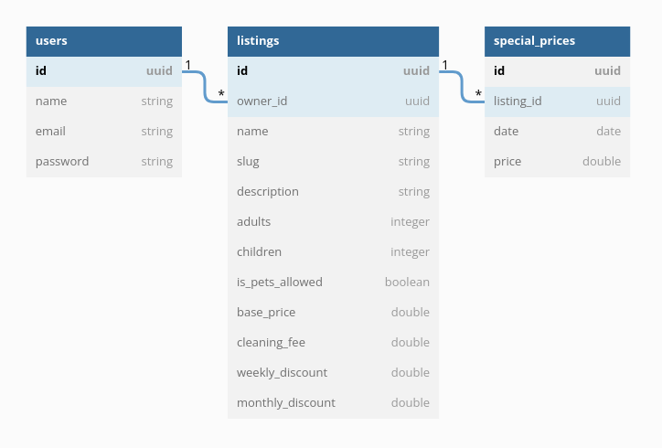

# DZConseil Software Engineer Challenge - Backend <!-- omit in toc -->

- [Introduction](#introduction)
- [Requirement](#requirement)
- [Notes](#notes)
- [Expectations](#expectations)
- [Problem Statement](#problem-statement)
- [Project Setup](#project-setup)
- [Endpoints](#endpoints)
    - [Show all listings](#show-all-listings)
    - [Show listing](#show-a-listing)
    - [Create a new listing](#create-a-new-listing)
    - [Update a listing](#update-a-listing)
    - [Delete a listing](#delete-a-listing)

## Introduction

As a software engineer in **DZConseil** team, you have to provide a reliable **backend** system to clients.
Your task here is to implement a few features for a small **Airbnb** like rest api.

## Requirement

- We value a **clean**, **simple** working solution.
- The solution must be written with the latest version of [Laravel](https://laravel.com/)
  and [PHP](https://www.php.net/).
- Good understanding for how git works.
- Good understanding of **REST API's**.

## Notes

- Source code must be pushed as git branch in the provided
  project [repository](https://github.com/dzconseil/backend-challenge).
- Your branch name should follow this scheme `challenge/lastname-firstname`.

## Expectations

- This challenge should take around 6 to 8 hours to complete.
- All tests within your branch must pass.
- Avoid over-engineering.
- All responses should be in a **JSON** format.

## Problem Statement



- Following this diagram we want to implement a small api service that our frontend users can consume.
- This restfull API should give us the ability to [list](#show-all-listings), [view](#show-a-listing)
  , [create](#create-a-new-listing), [update](#update-a-listing) and [delete](#delete-a-listing) a listing.
- The reservation cost calculation methods `calculateCost()` & `calculateDiscount()` should be implemented
  in `Listing` model

## Project Setup

In order to get a copy of this project on your machine you need to run the following command:

```bash
git clone git@github.com:dzconseil/backend-challenge.git dzconseil-challenge
```

This will get you a copy of this project into a folder named `dzconseil-challenge`

Now you need to create a new branch to start working on, run the following command :

```bash
git checkout -b challenge/lastname-firstname
```

You will notice that we provided you with the project skeleton with almost everything included (`routes`, `models`
, `migration`, `controllers`, `requests`, `resources`, `tests`)
all you need to do is to fill in the missing logic's and run the tests.

All tests within this project should pass before you push your code.

## Endpoints

### Show all listings

- **Request**
    - URI : `/api/listings`
    - Method : `GET`

- **Response**
    - Status : `200`
    - Body :
      ```json
      {
        "data": [
          {
            "id": "28eed9aa-c27d-4217-ab21-ad65ead3a2aa",
            "owner_id": "59f6d752-97cf-414e-a794-42794ac7511a",
            "name": "Warner",
            "slug": "warner",
            "description": "Maecenas ut massa quis augue luctus tincidunt.",
            "adults": 10,
            "children": 2,
            "is_pets_allowed": true,
            "base_price": 95.38,
            "cleaning_fee": 4.33,
            "image_url": null,
            "weekly_discount": 0.13,
            "monthly_discount": 0.23
          },
          {
            "id": "b3a6e269-d0fa-4408-89b1-fe2e48963177",
            "owner_id": "e0b227da-dc6e-402c-8172-9d950ece4707",
            "name": "Burrows White",
            "slug": "burrows-white",
            "description": "Phasellus in felis. Donec semper sapien a libero. Nam dui. ",
            "adults": 9,
            "children": 2,
            "is_pets_allowed": false,
            "base_price": 160.51,
            "cleaning_fee": 31.45,
            "image_url": "storage/1/image.png",
            "weekly_discount": 0.77,
            "monthly_discount": 0.36
          }
        ]
      }
      ```

**[⬆ back to top](#introduction)**

### Show a listing

- **Request**
    - URI : `/api/listings/:uuid`
    - Method : `GET`

- **Response**
    - Status : `200`
    - Body :
      ```json
      {
        "data": {
          "id": "b3a6e269-d0fa-4408-89b1-fe2e48963177",
          "owner_id": "e0b227da-dc6e-402c-8172-9d950ece4707",
          "name": "Burrows White",
          "slug": "burrows-white",
          "description": "Phasellus in felis. Donec semper sapien a libero. Nam dui. ",
          "adults": 9,
          "children": 2,
          "is_pets_allowed": false,
          "base_price": 160.51,
          "cleaning_fee": 31.45,
          "image_url": "storage/1/image.png",
          "weekly_discount": 0.77,
          "monthly_discount": 0.36,
          "special_prices": [
            {
              "id" : "b7b81974-51b7-4989-bd8d-28450c8466d1",
              "date": "2019-10-12",
              "price": 40.51
            },
            {
              "id" : "d3f39186-319a-4099-988c-a713c09d72b8",
              "date": "2019-10-13",
              "price": 80
            }
          ]
        }
      }
      ```

**[⬆ back to top](#introduction)**

### Create a new listing

- **Request**
    - URI : `/api/listings`
    - Method : `POST`
    - Body :

      ```json
      {
        "name": "Black Raven",
        "description": "Morbi porttitor lorem id ligula. Suspendisse ornare consequat lectus. In est risus, auctor sed.",
        "adults": 3,
        "children": 2,
        "is_pets_allowed": 1,
        "base_price": 195.62,
        "cleaning_fee": 95.82,
        "image": <file>,
        "weekly_discount": 0.77,
        "monthly_discount": 0.61
      }
      ```

- **Response**
    - Status : `201`
    - Body :
      ```json
      {
        "data": {
          "id": "d290f1ee-6c54-4b01-90e6-d701748f0851",
          "owner_id": "d701748f-6c54-4b01-90e6-d701748f0822",
          "name": "Black Raven",
          "slug": "black-raven",
          "description": "Morbi porttitor lorem id ligula. Suspendisse ornare consequat lectus. In est risus, auctor sed.",
          "adults": 3,
          "children": 2,
          "is_pets_allowed": true,
          "base_price": 195.62,
          "cleaning_fee": 95.82,
          "image_url": "storage/2/black-raven.jpg",
          "weekly_discount": 0.77,
          "monthly_discount": 0.61
        }
      }
      ```

**[⬆ back to top](#introduction)**

### Update a listing

- **Request**
    - URI : `/api/listings/:uuid`
    - Method : `PUT`
    - Body:

      ```json
      {
        "name": "White Raven",
        "description": "Morbi porttitor lorem id ligula",
        "adults": 3,
        "children": 2,
        "is_pets_allowed": true,
        "base_price": 195.62,
        "cleaning_fee": 95.82,
        "image": null,
        "weekly_discount": 0,
        "monthly_discount": 0.61
      }
      ```

- **Response**

    - Status : `200`
    - Body :
      ```json
      {
        "data": {
          "id": "d290f1ee-6c54-4b01-90e6-d701748f0851",
          "owner_id": "d701748f-6c54-4b01-90e6-d701748f0822",
          "name": "White Raven",
          "slug": "white-raven",
          "description": "Morbi porttitor lorem id ligula. Suspendisse ornare consequat lectus. In est risus, auctor sed.",
          "adults": 3,
          "children": 2,
          "is_pets_allowed": true,
          "base_price": 195.62,
          "cleaning_fee": 95.82,
          "image_url": "storage/2/black-raven.jpg",
          "weekly_discount": 0.77,
          "monthly_discount": 0.61
        }
      }
      ```

**[⬆ back to top](#introduction)**

### Delete a listing

- **Request**
    - URI : `/api/listings/:uuid`
    - Method : `DELETE`

- **Response**
    - Status : `200`
    - Body :

      ```json
      {
        "id": "d290f1ee-6c54-4b01-90e6-d701748f0851"
      }
      ```

**[⬆ back to top](#introduction)**

**Questions? Suggestions? We love to hear from you: <techchallenge@dzconseil.com>**
