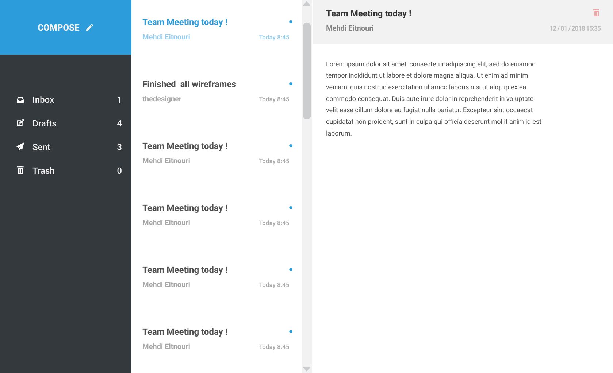

# Dzconseil Software Engineer Challenge - Frontend

## Introduction

As a software engineer in **dzconseil** team, you have to provide a reliable **frontend** application to clients. Your task here is to develop an inbox to `list/show/create` **threads**.

## Requirement

1. We value a **clean**, **simple** working solution.
2. Solution must work on all modern browsers (IE excluded).
3. We prefer [React](https://reactjs.org/), but the solution can also be written in pure javascript or one of the following libraries: [vuejs](https://vuejs.org/) or [preactjs](https://preactjs.com/) but feel free to use other tech if you prefer.
4. The solution must be production ready.

## Notes

- Source code must be stored in a git repository ( you can send us a link to a [Github](https://github.com/), [Bitbucket](https://bitbucket.com/) or [Gitlab](https://gitlab.com/) repo )

- For public repos:
  - Repository must avoid containing words like `dzconseil` and `challenge`.
  - Do not copy-paste any part of this file. (task, API documentation, etc.)
  - This is needed to prevent other candidates from finding your solution.
- Your repo should be easy to setup with clear instruction.
- (Optional) Deploy as a public site to your own host.

## Expectations

- This challenge should take around 4 hours to complete.
- Your code should be modular, each module should focus on doing one thing and do it well.
- Avoid over-engineering.
- Be cautious of third-party library usage. (Don't include a 300KB library only for 1 helper function)

## Problem Statement

We are switching most of our projects from jQuery to React. We aim for reusable components and maintainable codebase when expansion, your task today as a frontend engineer is to build a single page inbox.

1. Must be a single page app (SPA) [See example](#interface)
2. Must implement 4 components as specified in the wireframe.

    - One Component to create a new thread
        - To create a thread, the interface must provide a subject and a recipient inputs.
          as well as a thread message textarea.
    - One Component to show a thread.
    - One Component to list all threads.
    - One Component to create a new message.
        - A message should always belong to a thread.

## Interface

*For reference only, you can be creative with design and UI/UX features.*



**[⬆ back to top](#problem-statement)**

## Mock Api interface

### Create a new Thread

- **[Check Docs](https://app.swaggerhub.com/apis-docs/dzconseil/challenge/1.0.0#/default/post_threads)**
- Method: `POST`
- URL path: `https://virtserver.swaggerhub.com/dzconseil/challenge/1.0.0/threads/`
- Request body:

  ```json
  {
    "subject": "Team Metting!",
    "recipient": "example@dzconseil.com",
    "message": "hello, there is a meeting tommorw"
  }
  ```

**[⬆ back to top](#problem-statement)**

### Show Thread

- **[Check Docs](https://app.swaggerhub.com/apis-docs/dzconseil/challenge/1.0.0#/default/get_threads__threadID_)**
- Method: `GET`
- URL path: `https://virtserver.swaggerhub.com/dzconseil/challenge/1.0.0/threads/{uuid}`

**[⬆ back to top](#problem-statement)**

### List Threads

- **[Check Docs](https://app.swaggerhub.com/apis-docs/dzconseil/challenge/1.0.0#/default/get_threads)**
- Method: `GET`
- URL path: `https://virtserver.swaggerhub.com/dzconseil/challenge/1.0.0/threads/`

**[⬆ back to top](#problem-statement)**

### Create a new Message

- **[Check Docs](https://app.swaggerhub.com/apis-docs/dzconseil/challenge/1.0.0#/default/post_threads__threadID_)**
- Method: `POST`
- URL path: `https://virtserver.swaggerhub.com/dzconseil/challenge/1.0.0/threads/{uuid}`
- Request body:

  ```json
  {
    "message": "hello, there is a meeting tommorw",
    "creator": "admin@dzconseil.com"
  }
  ```

**[⬆ back to top](#problem-statement)**

**Questions? Suggestions? We love to hear from you: <techchallenge@dzconseil.com>**