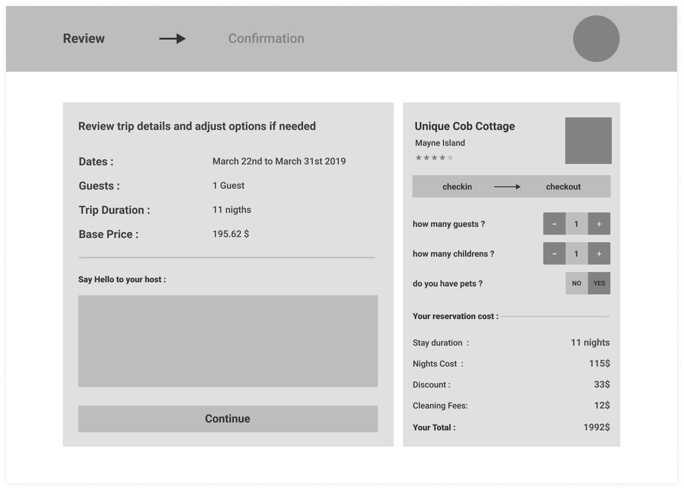
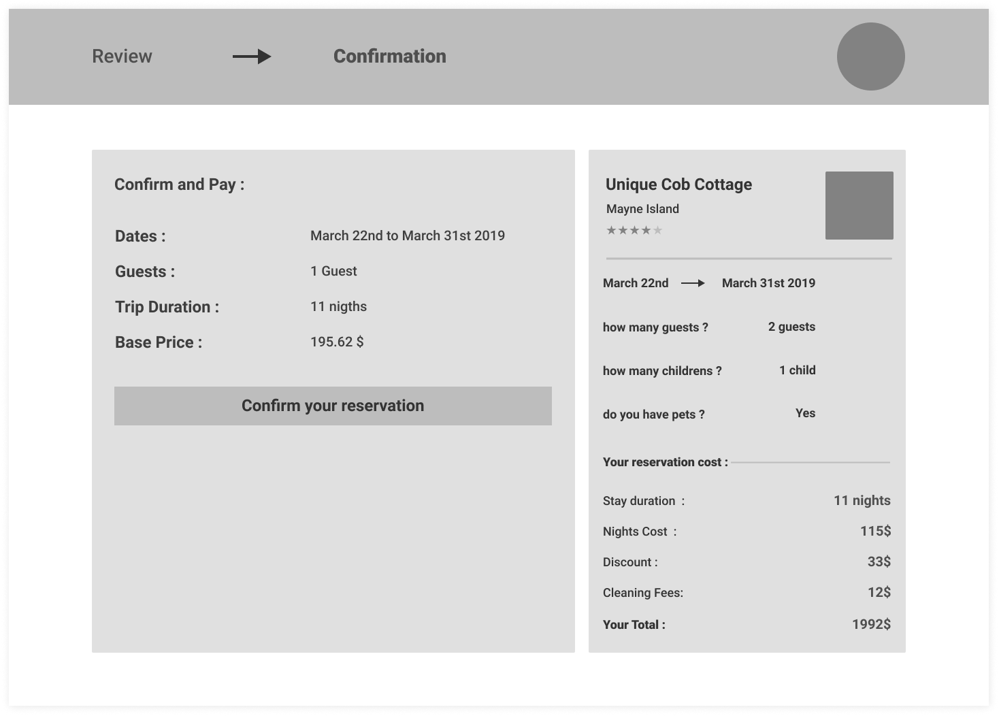

# dzconseil Software Engineer Challenge - Frontend <!-- omit in toc -->

- [Introduction](#introduction)
- [Requirement](#requirement)
- [Notes](#notes)
- [Expectations](#expectations)
- [Problem Statement](#problem-statement)
  - [Interface](#interface)
- [API interface](#api-interface)
  - [Get Listing information](#get-listing-information)
  - [Calculate Reservation Cost](#calculate-reservation-cost)
  - [Confirm Reservation](#confirm-reservation)

## Introduction

As a software engineer within **dzconseil** team, you have to provide a reliable **frontend** application to clients.
Your task here is to implement a checkout page for a small **Airbnb** like rest api.

## Requirement

1. We value a **clean**, **simple** working solution.
2. Solution must work on all modern browsers (IE excluded).
3. The solution must be written in [React](https://reactjs.org/).
4. The solution must be production ready.
5. Good understanding for how git works.
6. Good understanding of **REST API's** and **Http Clients**.

## Notes

- Source code must be pushed as git branch in the provided project repository. For this challenge we used a [Gitlab](https://gitlab.com/dzconseil/frontend-challenge) repo and [Create React App Starter](https://github.com/facebook/create-react-app)
- Your branch name should follow this scheme `challenge/lastname-firstname`.
- (Optional) Deploy as a public api to your own host.

## Expectations

- This challenge should take around **4** to **6** hours to complete.
- Your code should be modular, each module should focus on doing one thing and do it well.
- Avoid over-engineering.
- Be cautious of **third-party** library usage. Don't include a 300KB library only for 1 helper function.

## Problem Statement

The web is quickly evolving and most of companies are switching their projects from jQuery-ish apps to single page **React** apps.
At **dzconseil** we work a lot with this type of **Want to migrate** clients.

As a frontend engineer **Your Mission, Should You Choose To Accept It** 💻 is to build a checkout page,
with at most 4 components for an **Airbnb** like website, where hosts can list their homes for rent,
and guests later can visit our website and book this homes for a specific duration called **Trip Duration**. [See Wireframe](#interface)

### Interface

_For reference only, you can be creative with design and UI/UX features._




Following this low fidelity wireframe we want to implement this checkout page as follows:

1. **Must** be a single page app (SPA).
2. **Must** implement 3 components as specified in the wireframe.

   - One Component for the navbar.
     - This Component **Must** provide a tab menu item to switch between review and confirmation tabs.
   - One Component to show the listing info and reservation info.
     - This Component **Must** provide a div to show all reservation related info "duration,guests".
     - This Component **Must** provide a textarea element for the user to enter a hello message for the host.
     - This Component **Must** provide a **Continue** button when clicked, and should lead to the next tab "confirmation".
     - This Component **Must** provide a **Confirm** button when clicked, and should send the payload to backend.
   - One Component to calculate reservation cost.
     - This Component **Must** provide a date picker to select checkin and checkout dates with range.
     - This Component **Must** provide a simple counter element to increment or decrement guests count.
     - This Component **Must** provide a simple counter element to increment or decrement children's count.
     - This Component **Must** provide a toggle switch to let users decide if they include pet's or not.
     - This Component **Must** provide a div to show the reservation cost when the user changes any of the inputs above.

**[⬆ back to top](#introduction)**

## API interface

### Get Listing information

- Method: `GET`
- URL path: `/api/listings/:uuid`
- Header: `HTTP 200`
- Body:

  ```json
  {
    "id": "28eed9aa-c27d-4217-ab21-ad65ead3a2aa",
    "owner_id": "59f6d752-97cf-414e-a794-42794ac7511a",
    "name": "Warner",
    "slug": "revolutionize-warner",
    "description": "Maecenas ut massa quis augue luctus tincidunt.",
    "adults": 10,
    "children": 2,
    "is_pets_allowed": true,
    "base_price": 95.38,
    "cleaning_fee": 4.33,
    "image_url": "http://dummyimage.com/241x240.jpg/ff4444/ffffff",
    "weekly_discount": 0.13,
    "monthly_discount": 0.23,
    "special_prices": [
      {
        "date": "2019-10-12",
        "base_price": 40.51
      },
      {
        "date": "2019-10-13",
        "base_price": 80
      }
    ]
  }
  ```

**[⬆ back to top](#introduction)**

### Calculate Reservation Cost

- Method: `POST`
- URL path: `/api/listings/:uuid/reservation-cost`

- Request body:

  ```json
  {
    "checkin": "2019-12-06",
    "checkout": "2019-12-10",
    "adults": 2,
    "children": 1,
    "pets": false
  }
  ```

- Response:
  Header: `HTTP 200`
  Body:

  ```json
  {
    "nights_count": 4,
    "nights_cost": 95.82,
    "discount": 13.82,
    "cleaning_fee": 3.82,
    "total": 112.95
  }
  ```

### Confirm Reservation

- Method: `POST`
- URL path: `/api/listings/:uuid/confirm-reservation`

- Request body:

  ```json
  {
    "checkin": "2019-12-06",
    "checkout": "2019-12-10",
    "adults": 2,
    "children": 1,
    "pets": false,
    "message": "Hello Host!"
  }
  ```

- Response:
  Header: `HTTP 200`
  Body:

  ```json
  {
    "message": "success! thanks for your reservation"
  }
  ```

**[⬆ back to top](#introduction)**

**Questions? Suggestions? We love to hear from you: <techchallenge@dzconseil.com>**
