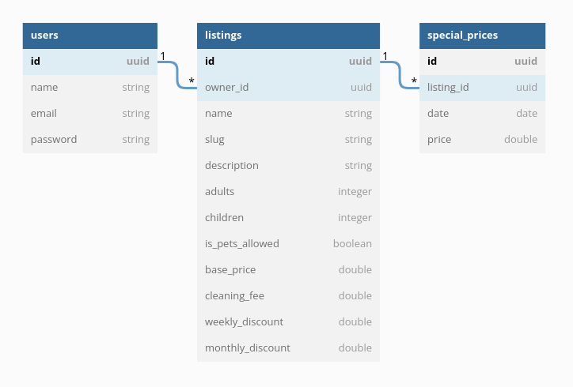

# Défis Tech DZConseil - Backend <!-- omit in toc -->

- [Introduction](#introduction)
- [Exigence](#exigence)
- [Remarques](#remarques)
- [Attentes](#attentes)
- [Déclaration du problème](#dclaration-du-problme)
- [Configuration du projet](#configuration-du-projet)
- [Endpoints](#endpoints)
  - [Afficher toutes les maisons](#afficher-toutes-les-maisons)
  - [Afficher une maison](#afficher-une-maison)
  - [Créer une nouvelle annonce maison](#crer-une-nouvelle-annonce-maison)
  - [Mettre à jour les informations d'une maison](#mettre--jour-les-informations-dune-maison)
  - [Supprimer une maison](#supprimer-une-maison)

## Introduction

En tant qu’ingénieur logiciel dans l'équipe **DZConseil**, vous devez fournir une solution **backend** fiable à nos clients.
Votre tâche ici est d'implémenter quelques fonctionnalités pour une api rest comme **Airbnb**.

## Exigence

1. Nous valorisons une solution **propre**, **simple** et efficace.
2. La solution doit fonctionner sur Ubuntu (18.04 LTS ou supérieure).
3. La solution doit être codé en [Laravel](https://laravel.com/).
4. La solution doit être prête pour la production.
5. Bonne compréhension du fonctionnement de git.
6. Bonne compréhension des **REST API's**.

## Remarques

- Le code source doit être poussé en tant qu'une branche git dans le repo de projet fourni. ( pour ce défi nous avons utilisé une [GitHub](https://github.com/dzconseil/backend-challenge) repository )
- Votre nom de branche devrait suivre ce schéma `challenge/lastname-firstname`.
- (Facultatif) Déployez en tant qu'API publique sur votre propre hôte..

## Attentes

- Ce défi devrait durer environ 4 à 6 heures..
- Tous les tests dans votre branche doivent réussir.
- Votre code doit être modulaire, chaque module doit se concentrer sur une chose à faire et bien le faire.
- Éviter le over-engineering.

## Déclaration du problème

_Pour référence seulement._



En suivant ce diagramme, nous souhaitons mettre en place un petit service api que nos utilisateurs peuvent utiliser.
Cette api restfull devrait nous permettre de créer des nouvelles maisons et de leur attribuer des prix spéciaux.
week-ends et vacances. il doit aussi permettre à nos clients de calculer un coût de réservation pour une maison.

1. Doit être une API HTTP **RESTful**
2. Doit implémenter 4 endpoints avec chemin, méthode, requette et corps de réponse comme spécifié

   - Une endpoint **CRUD** pour `lister/afficher/ajouter/supprimer` une maison [see sample](#create-a-new-listing)
   - Une endpoint pour `ajouter` un prix spécial à une maison [see sample](#add-special-price-to-listing)
   - Une endpoint pour `supprimer` un prix spécial [see sample](#create-a-new-listing)
   - Une endpoint pour `calculer` le coût de checkout pour une maison donnée [see sample](#calculate-checkout-cost)
     - Le coût de checkout peut être calculé sur une maison donnée.
     - Une erreur de réponse doit être envoyée si un utilisateur essaie de sélectionner une date passée comme checkin ou checkout.
     - La date de `checkin` doit être toujours avant la date de `checkout`.
     - `les clients` ne peuvent pas réserver une `maison` plus de **28 jours**.

3. Une base de données doit être utilisée (à **dzconseil**, nous utilisons **MySQL**).
4. Toutes les réponses doivent être au format **JSON**, peu importe la réussite ou l'échec.

## Configuration du projet

Pour obtenir une copie de ce projet sur votre machine, vous devez exécuter la commande suivante:

```bash
git clone git@github.com:dzconseil/backend-challenge.git dzconseil-challenge
```

Vous obtiendrez une copie de ce projet dans un dossier nommé `dzconseil-challenge`

Maintenant, vous devez créer une nouvelle branche pour commencer à travailler, exécutez la commande suivante:

```bash
git checkout -b challenge/lastname-firstname challenge
```

_Notez que nous créons ici une nouvelle branche à partir de la branche challenge et non de la branche master._

Vous remarquerez que nous vous avons fourni le skelton du projet avec presque tout, y compris `routes`,`modèles`, `migration`,`contrôleurs`, `tests`
tout ce que vous avez à faire est de remplir la logique manquante et d'exécuter les tests.

tous les tests de ce projet doivent réussir avant que vous poussiez votre code.

## Endpoints

### Créer une nouvelle annonce maison

- la méthode: `POST`
- URL path: `/api/listings`
- le corps de la requête:

  ```json
  {
    "name": "Black Raven",
    "description": "Morbi porttitor lorem id ligula. Suspendisse ornare consequat lectus. In est risus, auctor sed.",
    "adults": 3,
    "children": 2,
    "is_pets_allowed": true,
    "base_price": 195.62,
    "cleaning_fee": 95.82,
    "image_url": "http://dummyimage.com/126x173.bmp/cc0000/ffffff",
    "weekly_discount": 0.77,
    "monthly_discount": 0.61
  }
  ```

- Réponse:

  Entête: `HTTP 200`
  le corps de la reponse:

  ```json
  {
    "id": "d290f1ee-6c54-4b01-90e6-d701748f0851",
    "owner_id": "d701748f-6c54-4b01-90e6-d701748f0822",
    "name": "Black Raven",
    "slug": "black-raven",
    "description": "Morbi porttitor lorem id ligula. Suspendisse ornare consequat lectus. In est risus, auctor sed.",
    "adults": 3,
    "children": 2,
    "is_pets_allowed": true,
    "base_price": 195.62,
    "cleaning_fee": 95.82,
    "image_url": "http://dummyimage.com/126x173.bmp/cc0000/ffffff",
    "weekly_discount": 0.77,
    "monthly_discount": 0.61,
    "special_prices": []
  }
  ```

- Tips:

  Le champ **ID** dans la réponse est un **UUID** dans ce projet, nous utilisons le helper `Str:uuid()` du laravel pour gérer la génération des **UUID's** [lien vers laravel!](https://laravel.com/docs/6.x/helpers#method-str-uuid).

  Si vous trouvez ce format **JSON** étrange pour vous, lisez les spécifications de json api
  [lien vers jsonapi.org!](https://jsonapi.org).

**[⬆ retour au sommet](#introduction)**

### Afficher toutes les maisons

- la méthode: `GET`
- URL path: `/api/listings`

- Réponse:

  Entête: `HTTP 200`
  le corps de la reponse:

  ```json
  [
    {
      "id": "28eed9aa-c27d-4217-ab21-ad65ead3a2aa",
      "owner_id": "59f6d752-97cf-414e-a794-42794ac7511a",
      "name": "Warner",
      "slug": "revolutionize-warner",
      "description": "Maecenas ut massa quis augue luctus tincidunt.",
      "adults": 10,
      "children": 2,
      "is_pets_allowed": true,
      "base_price": 95.38,
      "cleaning_fee": 4.33,
      "image_url": "http://dummyimage.com/241x240.jpg/ff4444/ffffff",
      "weekly_discount": 0.13,
      "monthly_discount": 0.23,
      "special_prices": []
    },
    {
      "id": "b3a6e269-d0fa-4408-89b1-fe2e48963177",
      "owner_id": "e0b227da-dc6e-402c-8172-9d950ece4707",
      "name": "Burrows White",
      "slug": "burrows-white",
      "description": "Phasellus in felis. Donec semper sapien a libero. Nam dui. ",
      "adults": 9,
      "children": 2,
      "is_pets_allowed": false,
      "base_price": 160.51,
      "cleaning_fee": 31.45,
      "image_url": "http://dummyimage.com/149x114.png/ff4444/ffffff",
      "weekly_discount": 0.77,
      "monthly_discount": 0.36,
      "special_prices": [
        {
          "date": "2019-10-12",
          "base_price": 40.51
        },
        {
          "date": "2019-10-13",
          "base_price": 80
        }
      ]
    }
  ]
  ```

**[⬆ retour au sommet](#introduction)**

### Afficher une maison

- la méthode: `GET`
- URL path: `/api/listings/:uuid`

- Réponse:

  Entête: `HTTP 200`
  le corps de la reponse:

  ```json
  {
    "id": "d290f1ee-6c54-4b01-90e6-d701748f0851",
    "owner_id": "d701748f-6c54-4b01-90e6-d701748f0822",
    "name": "Black Raven",
    "slug": "black-raven",
    "description": "Morbi porttitor lorem id ligula. Suspendisse ornare consequat lectus. In est risus, auctor sed.",
    "adults": 3,
    "children": 2,
    "is_pets_allowed": true,
    "base_price": 195.62,
    "cleaning_fee": 95.82,
    "image_url": "http://dummyimage.com/126x173.bmp/cc0000/ffffff",
    "weekly_discount": 0.77,
    "monthly_discount": 0.61,
    "special_prices": []
  }
  ```

**[⬆ retour au sommet](#introduction)**

### Mettre à jour les informations d'une maison

- la méthode: `PUT`
- URL path: `/api/listings/:uuid`
- le corps de la requête:

  ```json
  {
    "name": "Black Raven",
    "description": "Morbi porttitor lorem id ligula",
    "adults": 3,
    "children": 2,
    "is_pets_allowed": true,
    "base_price": 195.62,
    "cleaning_fee": 95.82,
    "image_url": "http://dummyimage.com/126x173.bmp/cc0000/ffffff",
    "weekly_discount": 0,
    "monthly_discount": 0.61
  }
  ```

- Réponse:

  Entête: `HTTP 200`
  le corps de la reponse:

  ```json
  {
    "id": "d290f1ee-6c54-4b01-90e6-d701748f0851",
    "owner_id": "d701748f-6c54-4b01-90e6-d701748f0822",
    "name": "Black Raven",
    "slug": "black-raven",
    "description": "Morbi porttitor lorem id ligula",
    "adults": 3,
    "children": 2,
    "is_pets_allowed": true,
    "base_price": 195.62,
    "cleaning_fee": 95.82,
    "image_url": "http://dummyimage.com/126x173.bmp/cc0000/ffffff",
    "weekly_discount": 0,
    "monthly_discount": 0.61,
    "special_prices": []
  }
  ```

**[⬆ retour au sommet](#introduction)**

### Supprimer une maison

- la méthode: `DELETE`
- URL path: `/api/listings/:uuid`

- Réponse:

  Entête: `HTTP 200`
  le corps de la reponse:

  ```json
  {
    "id": "d290f1ee-6c54-4b01-90e6-d701748f0851"
  }
  ```

**[⬆ retour au sommet](#introduction)**

### Ajouter un prix spécial à une maison

- la méthode: `POST`
- URL path: `/api/listings/:uuid/special-prices`
- le corps de la requête:

  ```json
  {
    "date": "2019-12-06",
    "price": 95.82
  }
  ```

- Réponse:
  Entête: `HTTP 200`
  le corps de la reponse:

  ```json
  {
    "id": "d290f1ee-6c52-4b02-90e6-d701748f9854",
    "date": "2019-12-06",
    "price": 95.82
  }
  ```

### Supprimer un prix spécial

- la méthode: `DELETE`
- URL path: `/api/listings/:uuid/special-prices/:uuid`

- Réponse:
  Entête: `HTTP 200`
  le corps de la reponse:

  ```json
  {
    "id": "d290f1ee-6c52-4b02-90e6-d701748f9854"
  }
  ```

  **[⬆ retour au sommet](#introduction)**

### Calculer le coût de la réservation

- la méthode: `GET`
- URL path: `/api/listings/:uuid/checkout`

- le corps de la requête:

  ```json
  {
    "checkin": "2019-12-06",
    "checkout": "2019-12-10"
  }
  ```

- Réponse:
  Entête: `HTTP 200`
  le corps de la reponse:

  ```json
  {
    "nights_count": 4,
    "nights_cost": 95.82,
    "discount": 13.82,
    "cleaning_fee": 3.82,
    "total": 112.95
  }
  ```

**[⬆ retour au sommet](#introduction)**

**Des questions? Suggestions? Nous aimons répondre: <techchallenge@dzconseil.com>**
